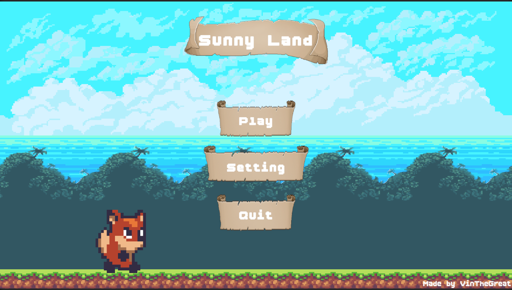
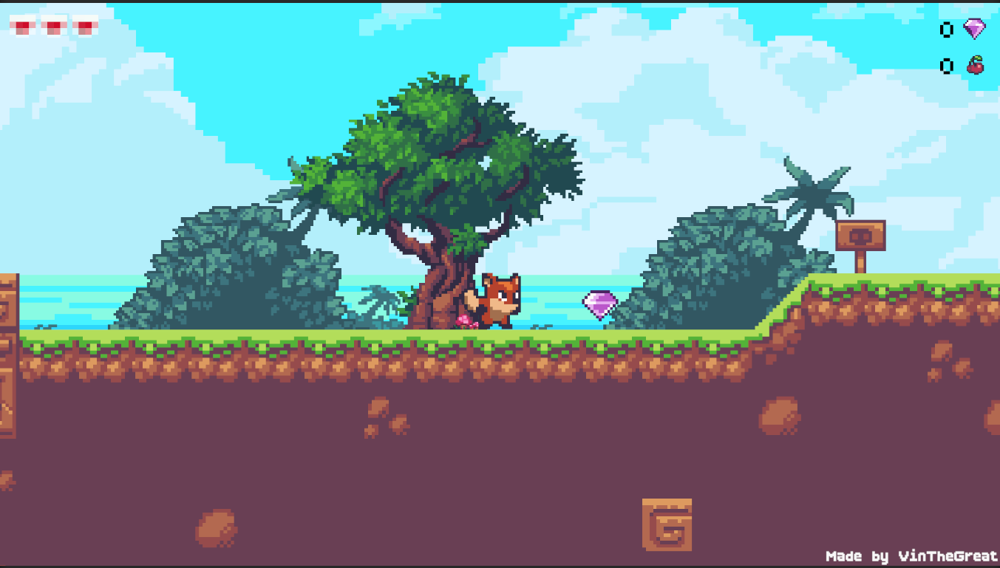

<div align="center">

# 🌿 Sunny Land — 2D Platformer Game

**A classic 2D side-scrolling platformer built with Unity**

[](https://unity.com/)
[](https://learn.microsoft.com/en-us/dotnet/csharp/)
[](LICENSE)
[](https://unity.com/)

</div>

---

## 📸 Screenshots

<div align="center">

### 📌 Main Menu


### 🎮 Gameplay


</div>

---

## 📖 About

**Sunny Land** adalah game platformer 2D yang dibangun menggunakan Unity Engine. Pemain mengontrol karakter yang berlari, melompat, mengumpulkan koin (gem & cherry), dan menyelesaikan setiap level. Game ini dikembangkan sebagai proyek pembelajaran Unity dengan fitur-fitur lengkap seperti sistem level bertahap, manajemen audio, dan sistem nyawa berbasis hati.

---

## ✨ Fitur Utama

| Fitur | Deskripsi |
|---|---|
| 🎮 **Multi-Level** | 3 level yang dapat dimainkan secara berurutan |
| 🔒 **Level Lock System** | Level terkunci hingga level sebelumnya diselesaikan |
| 💎 **Collectibles** | Kumpulkan Gem dan Cherry di setiap level |
| ❤️ **Health System** | Sistem nyawa berbasis hati (Heart Health System) |
| 🎵 **Audio Manager** | BGM & SFX dengan AudioMixer, volume tersimpan di PlayerPrefs |
| ⚙️ **Settings Panel** | Slider & toggle untuk musik dan SFX |
| 📜 **Scrolling Background** | Parallax scrolling background yang dinamis |
| 🏁 **Finish System** | Sistem garis finish dengan unlock level otomatis |
| 💀 **Game Over Panel** | Panel Game Over dengan tombol restart |
| 🏆 **Level Complete Panel** | Panel kemenangan dengan tombol next level |

---

## 🗂️ Struktur Proyek

```
game-learn/
├── Assets/
│   ├── Scripts/
│   │   ├── GameManager.cs          # Singleton utama, data gems & cherries
│   │   ├── UIManager.cs            # Update semua elemen UI di scene
│   │   ├── AudioManager.cs         # Singleton audio, BGM & SFX
│   │   ├── MainMenuManager.cs      # Kontrol panel Main Menu
│   │   ├── LevelSelectionManager.cs# Generate tombol level + sistem unlock
│   │   ├── FinishPoint.cs          # Deteksi player selesai level
│   │   ├── ScrollingBackground.cs  # Efek scrolling background parallax
│   │   └── Editor/
│   │       ├── PlayerPrefsHelper.cs # Tool editor untuk debug PlayerPrefs
│   │       └── ClearPlayerPrefs.cs  # Tool editor untuk reset progress
│   ├── Scenes/                     # Scene Unity (MainMenu, Level1–Level6)
│   ├── Prefabs/                    # Prefab karakter, enemy, collectible
│   ├── BoldPixels/                 # Asset pixel art
│   ├── SunnyLand Artwork/          # Sprite sheet utama
│   ├── HealthHeartSystem/          # Sistem hati / HP visual
│   ├── RPG&Fantasy Mobile GUI/     # Asset UI RPG
│   ├── Pixel Parchment UI/         # Asset UI parchment
│   └── TextMesh Pro/               # Font & text rendering
├── img-game/                       # Screenshot untuk dokumentasi
│   ├── image.png
│   └── image-2.png
└── README.md
```

---

## 🧠 Arsitektur Script

### `GameManager.cs`
Singleton yang bertahan antar scene (`DontDestroyOnLoad`). Bertanggung jawab atas:
- Menyimpan total **gems** dan **cherries** yang dikumpulkan
- Mengelola **BGM** (Background Music)
- Memanggil `UIManager` untuk update tampilan
- Menangani logika **Game Over** (freeze waktu, tampilkan panel)

### `AudioManager.cs`
Singleton audio global. Fitur:
- Mengelola **BGM** dengan `AudioSource` yang looping
- Konversi nilai slider linear → **desibel** menggunakan `Mathf.Log10` untuk perubahan volume yang natural
- Menyimpan dan memuat pengaturan volume via `PlayerPrefs`
- Method `PlaySFX()` untuk memutar sound effect dari script mana pun

### `UIManager.cs`
Mengelola semua elemen UI dalam satu scene gameplay:
- Update teks **Gem**, **Cherry**, dan **Lives**
- Mendukung **sprite hati** (seperti game Zelda)
- Fitur **Auto-Find** via `FindText()` jika komponen belum di-assign di Inspector
- Tampilkan panel **Game Over** dan **Level Complete**

### `MainMenuManager.cs`
Mengontrol navigasi antar panel di scene Main Menu:
- Berpindah antara **Main Menu**, **Settings**, dan **Level Selection**
- Inisialisasi nilai slider volume dari `PlayerPrefs`
- Tombol: **Play**, **Settings**, **Quit**, dan **Back**

### `LevelSelectionManager.cs`
Generate tombol level secara dinamis menggunakan Grid Layout:
- Mendukung **TextMeshPro** dan **Legacy Text**
- Tombol level **terkunci** (dengan overlay gelap & icon gembok) jika level sebelumnya belum selesai
- Data unlock disimpan di `PlayerPrefs` key `"HighestUnlockedLevel"`
- Static method `UnlockNextLevel()` dan `ResetProgress()` yang bisa dipanggil dari mana pun

### `FinishPoint.cs`
Deteksi trigger 2D ketika player menyentuh garis finish:
- **Unlock level berikutnya** secara otomatis
- Menyembunyikan sprite & menonaktifkan collider player
- Menampilkan panel **Level Complete** atau langsung pindah scene jika panel belum dibuat
- Menggunakan `Invoke()` untuk delay sebelum load scene berikutnya

---

## 🎮 Cara Bermain

1. **Main Menu** — Pilih **Play** untuk masuk ke Level Selection
2. **Level Selection** — Pilih level yang tersedia (level terkunci akan tampil dengan gembok 🔒)
3. **Dalam Level**:
   - `← →` / `A D` — Gerak kiri/kanan
   - `Space` / `W` / `↑` — Lompat
   - Kumpulkan 💎 **Gem** dan 🍒 **Cherry**
   - Hindari musuh atau ambil damage (nyawa berkurang)
4. **Selesaikan Level** — Sentuh garis finish untuk membuka level berikutnya
5. **Game Over** — Jika nyawa habis, pilih **Restart** atau kembali ke **Main Menu**

---

## ⚙️ Setup & Cara Membuka Proyek

### Persyaratan
- **Unity 2022.3 LTS** atau lebih baru
- **Universal Render Pipeline (URP)** (sudah terkonfigurasi)
- **TextMesh Pro** (sudah termasuk dalam project)

### Langkah-langkah

```bash
# 1. Clone repository ini
git clone https://github.com/Dialius/Sunny-Land.git

# 2. Buka Unity Hub
# 3. Klik "Add" → pilih folder 'Sunny-Land'
# 4. Buka dengan versi Unity yang sesuai
```

### Build Settings (Urutan Scene)
Pastikan scene di **File → Build Settings** sudah dalam urutan berikut:

| Index | Scene |
|-------|-------|
| 0 | MainMenu |
| 1 | Level1 |
| 2 | Level2 |
| 3 | Level3 |


---

## 🛠️ Editor Tools

Project ini dilengkapi dengan **Editor Tools** khusus untuk memudahkan development:

- **PlayerPrefs Helper** (`Assets/Scripts/Editor/PlayerPrefsHelper.cs`) — Lihat dan edit nilai PlayerPrefs langsung dari Unity Editor
- **Clear PlayerPrefs** (`Assets/Scripts/Editor/ClearPlayerPrefs.cs`) — Reset semua progress game (termasuk level unlock) dari menu editor

Akses via menu: **Tools → Game Dev Tools**

---

## 📦 Asset yang Digunakan

| Asset | Sumber |
|---|---|
| 🎨 SunnyLand Artwork | Sprite sheet pixel art utama |
| 🖼️ Pixel Parchment UI | Asset UI bertema parchment/kertas |
| ⚔️ RPG & Fantasy Mobile GUI | Asset UI bertema RPG |
| ❤️ Health Heart System | Sistem display nyawa berbasis hati |
| ✍️ TextMesh Pro | Text rendering berkualitas tinggi |
| 🔷 Unity 2D Animation | Animasi sprite 2D |
| 🌐 Universal Render Pipeline | Rendering pipeline modern |

---

## 🚀 Roadmap

- [ ] Tambah lebih banyak level
- [ ] Sistem musuh dengan AI sederhana
- [ ] Leaderboard / High Score
- [ ] Sound effect tambahan per aksi
- [ ] Mobile touch control support
- [ ] Save system berbasis file (JSON)
- [ ] Animasi transisi antar level

---

## 👨‍💻 Developer

**Dialius**
- GitHub: [@Dialius](https://github.com/Dialius)

---

## 📄 Lisensi

Project ini menggunakan lisensi **MIT**. Silakan gunakan untuk belajar dan dikembangkan lebih lanjut.

---

<div align="center">

⭐ **Jika project ini bermanfaat, jangan lupa beri bintang!** ⭐

Made with ❤️ using Unity Engine

</div>
